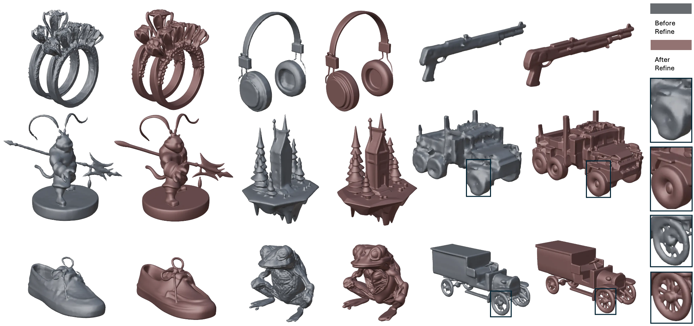

# DetailGen3D: Generative 3D Geometry Enhancement via Data-Dependent Flow

<div align="center">

[](https://detailgen3d.github.io/DetailGen3D/)
[](https://arxiv.org/abs/2411.16820)
[](https://huggingface.co/VAST-AI/DetailGen3D)
[](https://huggingface.co/spaces/VAST-AI/DetailGen3D)

</div>




## 🔥 Updates

### 📅 April 2025
- 🚀 **Initial Release**: Published code, pretrained models, and interactive demo.

## 🔨 Installation

Clone the repo:
```bash
git clone https://github.com/VAST-AI-Research/DetailGen3D.git
cd DetailGen3D
```

Create a conda environment (optional):
```bash
conda create -n detailgen3d python=3.10
conda activate detailgen3d
```

Install dependencies:
```bash
# pytorch (select correct CUDA version)
pip install torch torchvision --index-url https://download.pytorch.org/whl/{your-cuda-version}

# other dependencies
pip install -r requirements.txt
```

## 💡 Quick Start

### Step 1: Prepare coarse mesh
Upload a mesh with less detail. We recommend using these 3d generation tools:
- [TripoSR](https://huggingface.co/stabilityai/TripoSR)
- [InstantMesh](https://huggingface.co/spaces/TencentARC/InstantMesh)


### Step 2: Generate geometry details:
```bash
python scripts/inference_detailgen3d.py \
  --mesh_input assets/model/cb7e6c4a-b4dd-483c-9789-3d4887ee7434.glb \
  --image_input assets/image/cb7e6c4a-b4dd-483c-9789-3d4887ee7434.png
```

The required model weights will be automatically downloaded:
- DetailGen3D model from [VAST-AI/DetailGen3D](https://huggingface.co/VAST-AI/DetailGen3D) → `pretrained_weights/DetailGen3D`

## ⭐ Acknowledgements

We would like to thank the following open-source projects and research works that made DetailGen3D possible:

- [🤗 Diffusers](https://github.com/huggingface/diffusers) for their excellent diffusion model framework
- [HunyuanDiT](https://github.com/Tencent/HunyuanDiT) for DiT
- [FlashVDM](https://github.com/Tencent/FlashVDM) for their lightning vecset decoder
- [3DShape2VecSet](https://github.com/1zb/3DShape2VecSet) for 3D shape representation
- [TripoSG](https://github.com/VAST-AI-Research/TripoSG) as our base model

We are grateful to the broader research community for their open exploration and contributions to the field of 3D generation.

## 📚 Citation

```
@misc{deng2025detailgen3dgenerative3dgeometry,
      title={DetailGen3D: Generative 3D Geometry Enhancement via Data-Dependent Flow}, 
      author={Ken Deng and Yuan-Chen Guo and Jingxiang Sun and Zi-Xin Zou and Yangguang Li and Xin Cai and Yan-Pei Cao and Yebin Liu and Ding Liang},
      year={2025},
      eprint={2411.16820},
      archivePrefix={arXiv},
      primaryClass={cs.CV},
      url={https://arxiv.org/abs/2411.16820}, 
}
```
